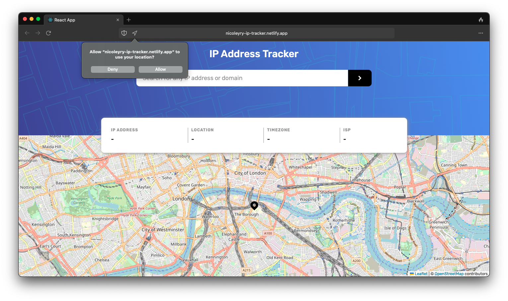
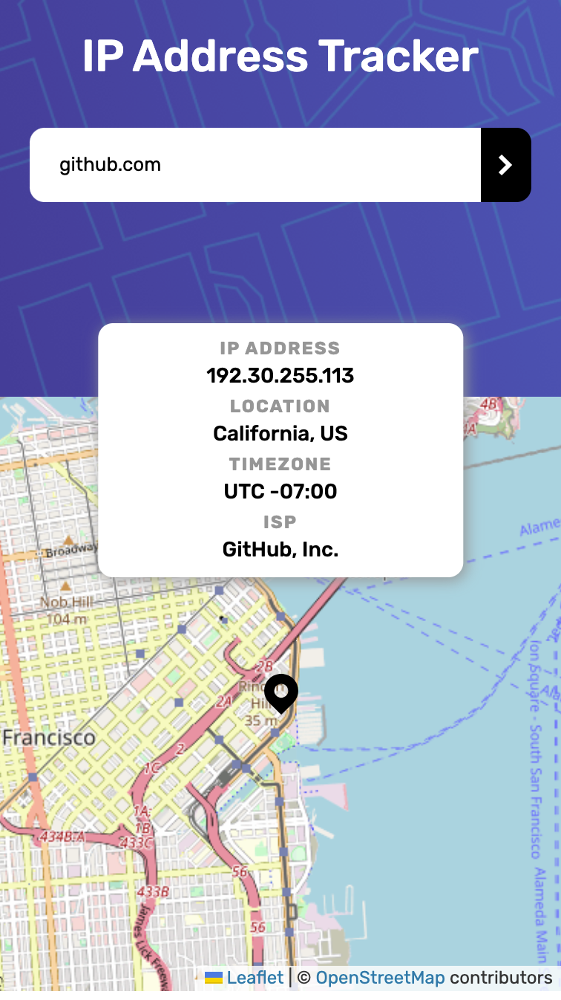

# Frontend Mentor - IP address tracker solution

This is a solution to the [IP address tracker challenge on Frontend Mentor](https://www.frontendmentor.io/challenges/ip-address-tracker-I8-0yYAH0). Frontend Mentor challenges help you improve your coding skills by building realistic projects. 

## Table of contents

- [Overview](#overview)
  - [The challenge](#the-challenge)
  - [Screenshot](#screenshot)
  - [Links](#links)
- [My process](#my-process)
  - [Built with](#built-with)
  - [Useful resources](#useful-resources)
- [Author](#author)

## Overview

### The challenge

Users should be able to:

- View the optimal layout for each page depending on their device's screen size
- See hover states for all interactive elements on the page
- See their own IP address on the map on the initial page load
- Search for any IP addresses or domains and see the key information and location

### Screenshot

    <h5>Desktop: </h5>
    

    <h5>Mobile: </h5>
    

### Links

- Solution URL: [https://www.frontendmentor.io/challenges/ip-address-tracker-I8-0yYAH0/hub?share=true](hhttps://www.frontendmentor.io/challenges/ip-address-tracker-I8-0yYAH0/hub?share=true)
- Live Site URL: [https://nicoleyry-ip-tracker.netlify.app/](https://nicoleyry-ip-tracker.netlify.app/)

## My process

### Built with

- Semantic HTML5 markup
- CSS custom properties
- Flexbox
- CSS Grid
- Mobile-first workflow
- [React](https://reactjs.org/) - JS library
- [SASS](https://sass-lang.com/) - For styles
- [IPify](https://geo.ipify.org/)
- [LeafletJS](https://leafletjs.com/)
- [React components for Leaflet maps](https://react-leaflet.js.org/)

### Useful resources

- [is-ip](https://github.com/sindresorhus/is-ip) - This helps to check if a string is an IP address.
- [Answer on StackOverflow](https://stackoverflow.com/questions/66500181/how-to-locate-react-leaflet-map-to-users-current-position-and-get-the-borders-f/66503808#66503808) - This answer helps to locate the user's current position.

## Author

- Website - [Nicole Yang](https://www.nicoleyry.com/)
- Frontend Mentor - [@nicoleyry](https://www.frontendmentor.io/profile/nicoleyry)
- Twitter - [@nicoleyry](https://twitter.com/nicoleyry)